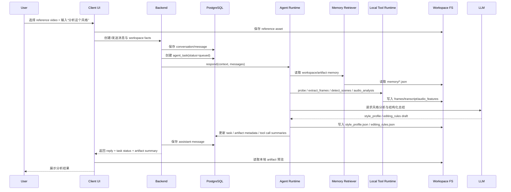
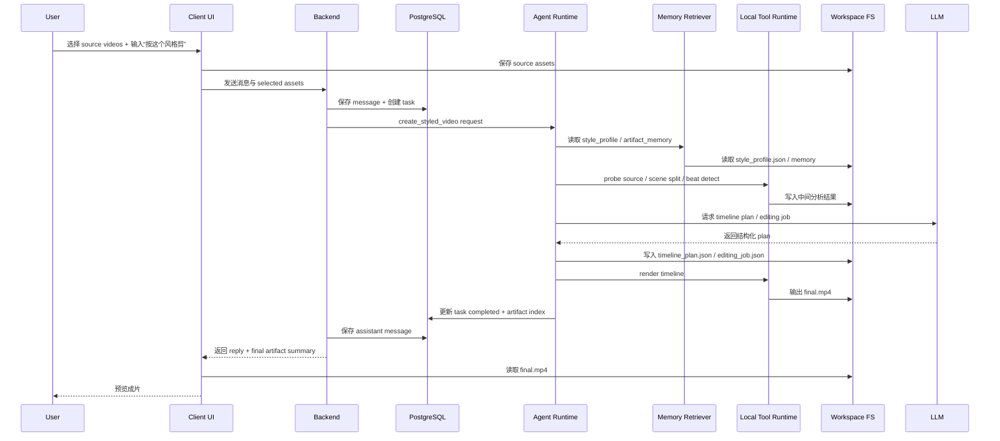
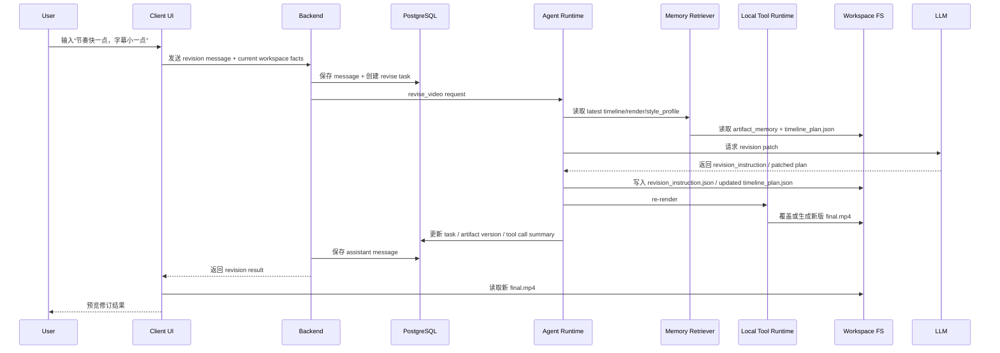
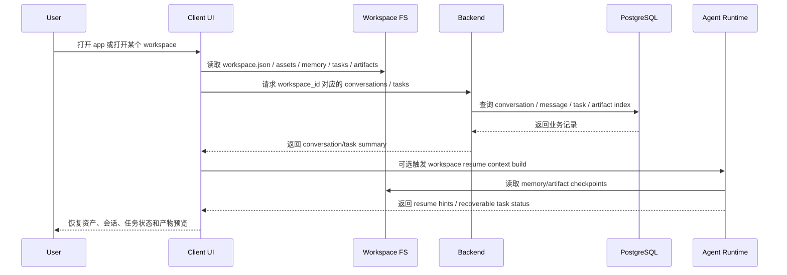

# System Architecture

这份文档是 CapCutAI 当前阶段的总架构拍板稿。

它要一次性回答 4 个问题：

1. 整体架构到底是什么
2. 每一层内部各自负责什么
3. 数据和控制流如何穿过系统
4. 每条核心 use case 从输入到输出会经过哪些模块

先给最终结论：

```txt
CapCutAI 采用 Local-first Agent Runtime 架构。
```

更完整一点：

```txt
Desktop Client
  -> Backend
  -> Local Agent Runtime
    -> Context Builder
    -> Memory Retriever
    -> LangGraph Orchestrator
    -> Local Tool Runtime
  -> Workspace File System
  -> PostgreSQL
  -> Cloud / Local LLM
```

最关键的边界是：

```txt
模型不直接操作客户端 UI
Agent Runtime 调用 Local Tool Runtime 暴露出来的受控本地能力
Client UI 只负责交互、展示、预览和任务状态反馈
```

---

## 1. Architecture Decision

CapCutAI 当前应该固定成下面这套心智：

```txt
Workspace is the product unit
Task is the execution unit
Artifact is the reusable output unit
Conversation is the interaction record
```

也就是说：

- 产品主语是 `workspace`
- 一次分析 / 生成 / 修订对应一个 `task`
- 真正能被复用的是 `artifacts` 和 `memory`
- `conversation` 只是交互记录，不是产品主心智

---

## 2. Runtime Topology

### 2.1 Full Runtime Map

```txt
User
  -> Desktop Client UI
    -> Backend API
      -> PostgreSQL
      -> Local Agent Runtime
        -> Context Builder
        -> Memory Retriever
        -> LangGraph Orchestrator
        -> Local Tool Runtime
          -> FFmpeg
          -> Frame Extraction
          -> Scene Split
          -> Audio Analysis
          -> ASR
          -> Remotion / Render Executor
        -> Workspace File System
        -> Cloud / Local LLM
```

### 2.2 Control Plane vs Data Plane

推荐固定成这个视角：

#### Control Plane

- user intent
- context
- memory retrieval
- AgentState
- task orchestration
- tool selection
- plan / revision generation
- task status

#### Data Plane

- raw videos
- extracted frames
- transcripts
- audio features
- style profiles
- timeline plans
- editing jobs
- final renders

一句话：

```txt
Agent Runtime 主要负责控制面
Workspace File System + Tool Runtime 主要承载数据面
```

---

## 3. Responsibility Matrix

### 3.1 Desktop Client UI

负责：

- 打开 / 创建 / 恢复 workspace
- 管理当前窗口级 workspace 上下文
- 选择 reference / source assets
- 展示 preview / timeline / agent panel
- 展示任务状态、activity、warnings
- 预览本地 `final.mp4`

不负责：

- 长期 memory 检索
- tool routing
- 复杂媒体执行
- 直接暴露任意 UI 动作给模型

### 3.2 Backend

负责：

- API 入口
- conversation / message 持久化
- task record 持久化
- workspace 级业务索引
- 调用 Agent Runtime
- 返回前端统一 response

不负责：

- prompt engineering
- graph routing
- 媒体执行
- 桌面窗口生命周期

### 3.3 Local Agent Runtime

负责：

- build normalized context
- retrieve relevant memory
- construct AgentState
- run graph
- generate structured plan
- dispatch local tools
- collect tool results
- write artifact metadata
- update workspace memory

不负责：

- 直接渲染 UI
- 管理桌面窗口
- 长期替代 backend 成为业务网关
- 自己变成底层媒体引擎

### 3.4 Local Tool Runtime

负责：

- video probe
- extract frames
- scene detection
- audio feature extraction
- optional ASR
- render execution
- transcode
- file validation

不负责：

- 任务意图判断
- memory selection
- 最终工作流决策

### 3.5 Workspace File System

负责：

- 原始素材保存
- 中间产物保存
- 最终产物保存
- workspace-local memory 保存
- task checkpoint 保存

### 3.6 PostgreSQL

负责：

- conversation records
- messages
- task records
- artifact index
- tool call summaries
- future cloud sync index

不负责：

- 保存原始视频大文件
- 保存抽帧全集
- 保存最终渲染文件本体

### 3.7 Cloud / Local LLM

负责：

- 理解用户需求
- 分析风格
- 生成 plan
- 解释结果
- 生成 revision patch

不负责：

- 直接操作 UI
- 直接执行 FFmpeg / Remotion
- 直接保存文件

---

## 4. Internal Modules

### 4.1 Backend Internal Modules

推荐固定成：

```txt
backend/
  api/http/
  application/
    conversation/
    message/
    task/
    artifact/
    agent/
  domain/
    conversation/
    message/
    task/
    artifact/
  infrastructure/
    persistence/
    agent/
    config/
```

### 4.2 AI Service / Agent Runtime Internal Modules

推荐固定成：

```txt
ai-service/app/
  api/
  graph/
    conversation/
    style_analysis/
    style_editing/
    revision/
  memory/
  tools/
  prompts/
  services/
  schemas/
  providers/
```

### 4.3 Local Tool Runtime Internal Modules

推荐长期拆成：

```txt
tool-runtime/
  video/
    probe
    extract_frames
    scene_split
  audio/
    extract_track
    detect_beats
    asr
  render/
    build_timeline
    remotion_render
    transcode
  workspace/
    validate_paths
    read_artifact
    write_artifact
```

如果第一版不单独起服务，也建议至少在逻辑上保持这层边界。

### 4.4 Client Internal Modules

推荐固定成：

```txt
frontend/src/features/
  workspace/
  assets/
  editor/
  im/
```

---

## 5. Storage Principles

这一层只保留高层原则：

- 原始视频、抽帧、中间产物、最终产物优先保存在本地 workspace
- 数据库存业务记录、索引、状态和摘要
- 文件系统保存“内容本体”，数据库保存“业务索引和状态记录”
- task 恢复依赖本地 checkpoint + 数据库任务记录

更细的文件布局、目标表设计、use case 到存储映射已经拆到：

- [`../../04-detailed-design/12-workspace-storage-and-target-schema/README.md`](../../04-detailed-design/12-workspace-storage-and-target-schema/README.md)

---

## 6. Sequence Diagrams

### 6.1 Analyze Reference Video



### 6.2 Create Styled Video from Source Videos



### 6.3 Revise Existing Output



### 6.4 Resume Workspace and Continue Work



---

## 7. Contracts That Should Be Defined Next

下一步最该拍板的是：

1. `Client -> Backend` raw context contract
2. `Backend -> Agent Runtime` normalized request contract
3. `AgentState` schema
4. `agent_tasks` / `workspace_artifacts` / `task_tool_calls` schema
5. `Local Tool Runtime` 的工具白名单和 I/O contract

---

## 8. Final Decision

如果只保留最硬的一版，就保留这几句：

```txt
CapCutAI 采用 Local-first Agent Runtime 架构
Workspace 是主语，Task 是执行单元，Artifact 是可复用输出
Client UI 不直接承载剪辑逻辑
Agent Runtime 负责思考、编排、memory retrieval 和 tool dispatch
Local Tool Runtime 负责本地媒体分析、渲染与导出
原始视频和最终产物优先保存在本地 workspace
数据库主要保存 conversation、task、artifact index、tool call summary 等业务记录
每条核心 use case 都必须同时落地：模块边界、存储归属、数据库表、时序链
```

---

## Related Docs

- Workspace Agent Runtime：[`../01-workspace-agent-runtime-model/README.md`](../01-workspace-agent-runtime-model/README.md)
- Client / Backend / AI Boundary：[`../02-client-backend-agent-tool-boundary/README.md`](../02-client-backend-agent-tool-boundary/README.md)
- Workspace Agent Use Cases：[`../../02-use-cases/01-workspace-agent-use-cases/README.md`](../../02-use-cases/01-workspace-agent-use-cases/README.md)
- Workspace Storage / Target Schema：[`../../04-detailed-design/12-workspace-storage-and-target-schema/README.md`](../../04-detailed-design/12-workspace-storage-and-target-schema/README.md)
- Database Storage：[`../../04-detailed-design/04-database-storage-design/README.md`](../../04-detailed-design/04-database-storage-design/README.md)
- AI Service Video Architecture：[`../../04-detailed-design/01-ai-service-video-architecture/README.md`](../../04-detailed-design/01-ai-service-video-architecture/README.md)
